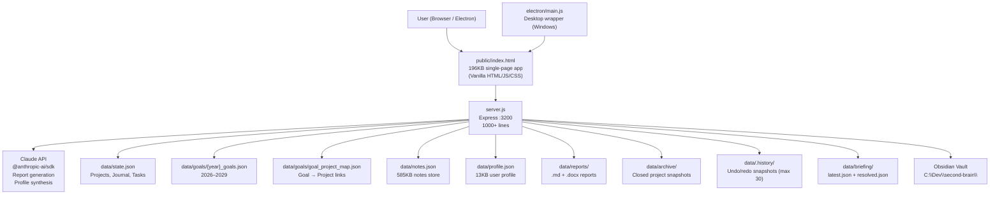

# Richards Projects
<!-- Last updated: 2026-05-03 -->

## Purpose

Personal project management hub for a Manufacturing Sciences team. Tracks active projects, milestones, risks, dependencies, multi-year goals, and journal entries — all scoped to work. Goes beyond a generic PM tool: integrates the Claude API for AI-assisted report drafting and profile generation, syncs bidirectionally with an Obsidian vault, and packages as a standalone Windows desktop app. Data lives exclusively on OneDrive (never GitHub) due to confidentiality.

## Current State

- **Status:** Active — fully functional
- **Latest report:** `data/reports/2026-05-03_checkin.docx` (most recent check-in)
- **Goals loaded:** 2026, 2027, 2028, 2029 goal files present
- **Archive:** Empty — no projects have been formally closed yet
- **Obsidian sync:** Endpoints exist (`/api/obsidian/push` and `/api/obsidian/pull`) but described as "not yet fully tested" in CLAUDE.md
- **Briefing system:** `data/briefing/latest.json` and `data/briefing/resolved.json` present — briefing feature appears active

## Architecture

**Key flows:**
- **Daily use:** Browser → `index.html` → Express API → reads/writes `data/*.json`
- **Goal import:** Upload `.docx` → mammoth parses → merge into `{year}_goals.json` (non-destructive)
- **Report generation:** Claude API synthesizes goals + project status → writes `.md` + `.docx` to `data/reports/`
- **Undo/redo:** Every write snapshots `state.json` into `data/.history/`; max 30 revisions
- **Electron desktop:** `electron/main.js` wraps the Express server + UI in a Windows native app

## Tech Stack

| Layer | Technology |
|---|---|
| Runtime | Node.js v24.x |
| Framework | Express.js |
| Frontend | Vanilla HTML/CSS/JS (single 196KB file — no build step) |
| Desktop | Electron + electron-builder (Windows NSIS + portable .exe) |
| Document I/O | mammoth (DOCX→HTML), docx (DOCX generation), xlsx (Excel), adm-zip |
| AI | @anthropic-ai/sdk ^0.91.1 (Claude API) |
| File upload | multer (250MB limit, max 20 files) |
| HTML parsing | cheerio |
| Storage | Flat JSON files (no database) via OneDrive sync |

## Key API Routes

| Route | Purpose |
|---|---|
| `GET/PUT /api/state` | Full project + journal state |
| `POST/PATCH/DELETE /api/project/:id` | Project CRUD |
| `POST /api/project/:id/close` | Archive project with summary |
| `GET/POST /api/goals` | Multi-year goal management |
| `POST /api/goals/upload-docx` | Parse goals from DOCX (mammoth) |
| `POST /api/goals/export-docx` | Export goals to DOCX |
| `PATCH /api/goals/:goalId` | Update goal status / quarterly notes |
| `GET/PUT /api/goals/map` | Goal ↔ project mapping |
| `POST /api/reports/generate` | Generate progress report |
| `POST /api/reports/ai-export-docx` | Claude-generated DOCX report |
| `POST /api/claude` | Direct Claude API call |
| `POST /api/profile/generate` | AI-assisted profile synthesis |
| `POST /api/obsidian/push` | Push data to Obsidian vault |
| `POST /api/obsidian/pull` | Pull data from Obsidian vault |
| `GET /api/briefing` / `POST /api/briefing/run` | Briefing generation + resolution |
| `POST /api/undo` / `POST /api/redo` | State version control |
| `POST /api/scan` / `POST /api/scan/apply` | File upload + transformation |

## Decisions Made

- **OneDrive-only, never GitHub** — contains personal goals, strategy, check-in content; treat as confidential
- **No database** — flat JSON is sufficient; OneDrive handles sync and backup
- **No frontend framework** — single bundled HTML for simplicity and portability (no build pipeline needed)
- **Multi-year goal files** — separate `{year}_goals.json` per year rather than one monolithic file; supports forward planning (2026–2029)
- **Non-destructive goal imports** — existing quarterly notes, IDs, and mappings are always preserved; removed goals get flagged "discontinued" not deleted
- **Undo/redo at file level** — snapshots entire `state.json` rather than diff-based; simple but uses storage
- **Windows-only Electron build** — NSIS installer + portable .exe; no macOS/Linux target needed

## Open Questions

- [ ] Obsidian sync (`/api/obsidian/push` and `/api/obsidian/pull`) — described as "not yet fully tested"; needs end-to-end verification
- [ ] `data/memory.md` is empty — intended purpose unclear; may be a scratch pad or future Claude memory hook
- [ ] `scripts/export-onenote.ps1` and `scripts/write_ps1.py` — unclear what these do; one-off utilities or part of a workflow?
- [ ] `POST /api/scan` / `POST /api/scan/apply` — file scanning feature purpose not documented
- [ ] `data/briefing/` system — what triggers a briefing run? Manual only or automated?

## Next Steps

1. Verify Obsidian sync works end-to-end (push a project update and check the vault)
2. Document the briefing system — how it generates content and what triggers it
3. Close any completed projects via `POST /api/project/:id/close` to populate `data/archive/`
4. Review `data/memory.md` — either populate it or remove the dead route
5. Generate a Q2 check-in report (`POST /api/reports/ai-export-docx`) ahead of next review cycle
